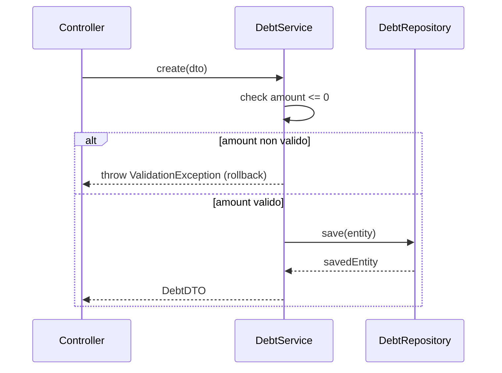

# CodeStudy

Strumento a riga di comando che **colma il debito di comprensione** del codice
scritto con l'AI: analizza un repository git locale, capisce come funziona/come è
cambiato il flusso, e genera **materiale di studio** — flashcard, mappe e note —
così puoi interiorizzarlo con **richiamo attivo** invece di rileggere diff a freddo.

## Perché

Quando usi strumenti AI per scrivere codice il risultato funziona, ma salti la
fatica cognitiva che normalmente ti farebbe memorizzare come gira l'app. CodeStudy
ricostruisce quel percorso al posto tuo e te lo restituisce come flashcard che
**testano la comprensione del flusso**, non la memoria a pappagallo.

## Le due modalità

- **`incremental`** — delta di commit. Dato un range (es. `HEAD~10..HEAD` o
  `<sha>..HEAD`) **oppure uno o più commit specifici** (`--commit`), per ogni file
  modificato produce spiegazione del cambio di flusso, flashcard e una mini-mappa.
  Le spiegazioni sono **proporzionate al peso della modifica**: i cambi piccoli
  ricevono un output minimale (una frase e una flashcard), quelli grandi il flusso
  completo. Con `--base <ref>` fai un **controllo pre-commit**: analizzi ciò che
  differisce da un branch/commit, **incluse le modifiche non ancora committate**.
  Uso quotidiano, leggero.
- **`full`** — intero software (onboarding). Mappa gerarchica bottom-up:
  L1 riassunto per file → L2 sintesi per modulo/cartella → L3 architettura macro.
  Poiché l'intero codebase non entra in un prompt, procede a livelli. Limitabile a
  una sotto-cartella con `--module`.

## Astrazione dei provider (il "motore" è intercambiabile)

Tutto il tool dipende da un'unica interfaccia `analyze(prompt, context) -> testo`.
Cambiare provider cambia **solo** il motore; git, analisi e output restano identici.

| provider | descrizione | chiave API |
|---|---|---|
| `claude-code-cli` *(default)* | invoca il CLI `claude` in headless (`claude -p … --output-format json`) sfruttando il tuo abbonamento | **nessuna** |
| `api` | API HTTP Anthropic o OpenAI-compatibile — predisposto, disattivo | via env |
| `local` | modello locale OpenAI-compatibile (Ollama / LM Studio), per privacy/offline | di norma nessuna |

> I segreti **non** stanno mai nel file di config: le chiavi si leggono dalla
> variabile d'ambiente indicata in `api_key_env`.

## Rilevamento dello stack (language-agnostic)

Lo stack è rilevato da manifest di build ed estensioni dei sorgenti; le **regole di
tracciamento del flusso** per linguaggio stanno in `codestudy/stack/rules/*.yaml`.
Aggiungere un linguaggio = aggiungere un file YAML (nessuna modifica al codice).
Inclusi: **Java/Spring**, **C#/.NET**, e `generic` (fallback diff-based). Se lo
stack non è riconosciuto, degrada con eleganza all'analisi generica.

## Analisi: flusso IBRIDO

Ogni analisi intreccia due livelli:
- **Flusso tecnico** — chi chiama chi, come si muovono i dati dalla request alla
  persistenza e ritorno, dove si valida/blocca e perché.
- **Flusso di business/dominio** — cosa succede per l'utente e quali regole di
  dominio governano l'operazione.

Flashcard e note coprono entrambi e ne chiariscono il collegamento
(«questa regola di business è implementata da questo controllo in questo service»).

## Installazione

```bash
pip install -e .
```

Richiede Python ≥ 3.9. Per il provider di default serve il CLI `claude` nel PATH.

## Uso

```bash
# 1) crea la config di esempio
codestudy init-config              # scrive codestudy.yaml

# 2) modalità incrementale (uso quotidiano)
codestudy incremental --repo . --range HEAD~10..HEAD

# 2b) uno o più commit specifici (ognuno analizzato a sé)
codestudy incremental --commit 2d24ce5 --commit 9890bc6

# 2c) controllo PRIMA di committare: cosa differisce dal branch, incluse
#     le modifiche non committate (i file nuovi vanno prima "git add"-ati)
codestudy incremental --base main     # tutto il tuo branch vs main
codestudy incremental --base HEAD      # solo il lavoro in sospeso

# 3) intero software (onboarding), eventualmente limitato a un modulo
codestudy full --repo . --module src/main/java/com/acme/debts

# override al volo
codestudy incremental --provider local --output ./studio -y
```

Prima di un run grande viene mostrata la **stima delle chiamate** e chiesta
conferma (`--yes`/`-y` per saltarla negli script).

## Output

Per ogni run viene prodotto **un unico file**: `./codestudy-output/<run-id>/report.html`.

È un report **self-contained** (CSS/JS inline, nessun file collaterale), pensato per
essere aperto direttamente nel browser:

- **Navigabile** — sidebar con indice di tutte le sezioni + ricerca live.
- **Completo** — panoramica del run, architettura macro (modalità `full`), e per ogni
  file/modulo: riassunto, **flusso tecnico** + **flusso di business/dominio**, note,
  **mappa Mermaid** renderizzata e **flashcard** interattive (click per rivelare la
  risposta; funzionano anche offline perché sono `<details>` nativi).
- **Mappa che localizza il cambio** — in modalità incrementale, la mappa del flusso
  **evidenzia il punto toccato dalla modifica** (nodo in ambra per i flowchart, nota
  dedicata per i sequenceDiagram), con una legenda sotto il diagramma, così vedi
  a colpo d'occhio *dove* nel flusso è avvenuto il cambiamento.
- **Scaricabile a sezioni** — ogni dettaglio (architettura, singolo file/modulo, il
  mazzo di flashcard) ha un pulsante **«⬇ Scarica dettaglio»** che esporta quella
  sola sezione come mini-HTML autonomo. L'export clona il DOM già renderizzato, quindi
  gli **SVG di Mermaid sono inclusi** e il file scaricato funziona senza rete.
- **Extra** — **«Scarica tutto»** (snapshot dell'intera pagina), **«CSV (Anki)»**
  (flashcard in formato `front,back,tags,deck`) e **«Stampa / PDF»**.

> Le mappe Mermaid vengono renderizzate caricando la libreria da CDN; se apri il
> report **senza rete**, al posto del diagramma viene mostrato il suo sorgente
> Mermaid (comunque leggibile).

### Esempio di flashcard reale (Java/Spring)

> **Q:** Se arriva un `DebtDTO` con `amount = -5`, in quale layer viene bloccata la
> richiesta e cosa succede alla transazione?
> **A:** Dentro `DebtService.create()`, prima di chiamare il repository: il check
> `if (dto.getAmount() <= 0)` lancia `ValidationException`. Essendo `@Transactional`,
> l'eccezione provoca rollback e nessuna riga viene scritta.

### Esempio di mappa reale



## Robustezza

- **Ripresa** — stato in SQLite (`<output_dir>/state.db`): un'unità già completata
  non viene rieseguita. Rilancia lo stesso run per riprendere da dove eri rimasto.
- **Parallelismo + backoff** — `workers` configurabile; retry con backoff
  esponenziale e messaggi chiari quando si viene limitati (rate limit).
- **Stima costi** — prima di un run grande mostra quante chiamate comporta e chiede
  conferma.
- **Errori puliti** — git assente/non-repo, range vuoto/non valido, provider che
  non risponde.

## Configurazione (`codestudy.yaml`)

```yaml
provider: claude-code-cli
output_dir: ./codestudy-output
commit_range: HEAD~10..HEAD
path_filters: []          # es. ["src/main/java/com/acme/debts"]
workers: 1
max_retries: 4
backoff_base_seconds: 2.0
max_payload_chars: 24000
minimal_threshold: 12     # <= righe cambiate ⇒ spiegazione minimale (solo summary + 1 flashcard)
providers:
  claude-code-cli: { command: claude, model: "", extra_args: [], timeout_seconds: 600 }
  api:   { base_url: https://api.anthropic.com/v1/messages, kind: anthropic, model: claude-sonnet-5, api_key_env: ANTHROPIC_API_KEY, max_tokens: 4096 }
  local: { base_url: http://localhost:11434/v1/chat/completions, model: llama3.1, api_key_env: "", max_tokens: 4096 }
```

## Architettura del codice

```
codestudy/
  cli.py            # comandi Typer: init-config, incremental, full
  config.py         # config YAML + override env (no segreti in chiaro)
  runner.py         # orchestrazione: ripresa, parallelismo/backoff, output
  models.py         # Unit, AnalysisResult, Flashcard
  providers/        # motore intercambiabile: base, claude_cli, api, local, factory
  vcs/              # estrattore git (subprocess)
  stack/            # rilevamento stack + rules/*.yaml (plugin per linguaggio)
  analyzer/         # prompts (flusso ibrido), incremental, full (bottom-up)
  output/           # report.html unico (report.py); moduli md/csv legacy riusabili
  state/            # store SQLite per la ripresa
```

I moduli sono separati per responsabilità: cambiare il provider, aggiungere un
linguaggio o un formato di output non tocca il resto.
